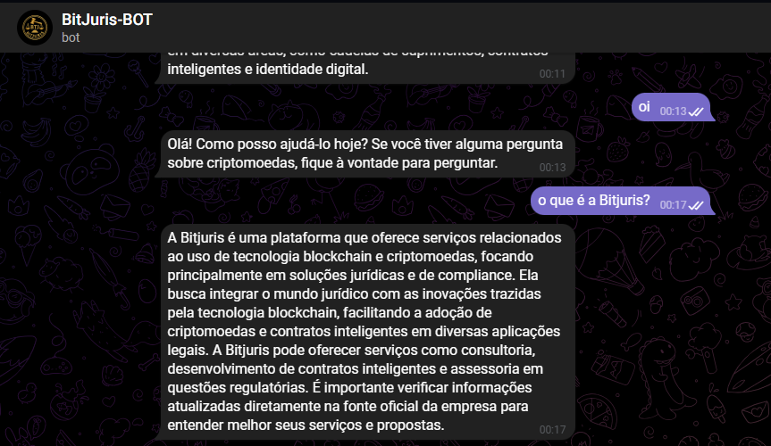

# BitJuris Telegram Bot

Telegram bot developed to support **BitJuris**, a LegalTech platform focused on blockchain, cryptoassets, and legal compliance.

The bot automates information delivery and user interaction, providing quick and structured responses about the platform and its services.

---

## 🤖 Bot Preview



> Example of the BitJuris Telegram bot handling automated user interactions and informational queries.

---

## 🎯 Purpose

The main goal of this bot is to:
- Automate initial user support via Telegram  
- Reduce repetitive manual responses  
- Provide clear and consistent information about BitJuris  
- Improve communication efficiency with the community  

---

## ⚙️ Features

- Automated responses to common questions  
- Structured command and message handling  
- Informational flow about BitJuris and its services  
- Ready for future integrations and feature expansion  

---

## 🧩 Architecture Overview

- Python-based Telegram bot  
- Modular command and handler structure  
- Easily extendable logic for new features  
- Designed for scalability and maintainability  

---

## 🛠️ Tech Stack

- **Python**
- **Telegram Bot API**
- Message handlers & command-based logic

---

## 🚀 How to Run

1. Clone the repository  
2. Install the required dependencies  
3. Configure the Telegram Bot Token as an environment variable  
4. Run the main bot script  

```bash
python main.py
